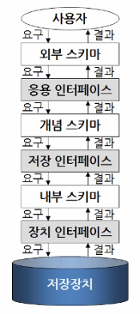
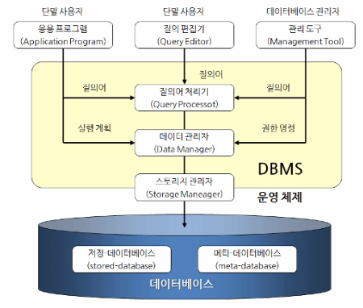

# [←](../README.md)

## ✍ RDBMS 논리적 구조와 구성

 

#### 1. 데이터베이스 시스템의 구성요소 : User, HW, SW, DB

    - 데이터베이스 시스템의 단계별 구조
>
    ├── 외부단계(외부스키마,개별 사용자 관점),
    │     응용 인터페이스
    ├── 개념단계(개념스키마, 관리자 관점),
    │     저장 인터페이스
    ├── 내부단계(DBMS, 컴퓨터 관점)
    └──  장치 인터페이스
        - 데이터베이스 스키마가 잘못되었다는건 익스터널스키마 보다 컨셉츄얼스키마를 얘기하는것
        - 전체 데이터베이스에 대한 논리적인 구조를 포함

 

#### 2. DBMS 의 구성요소

- DBA : 데이터베이스 관리자 (database administrator)
    - 스키마(Schema)의 정의,수정
    - 데이터 저장구조와 접근방법의 정의
    - 사용자에게 데이터 접근 권한을 부여
    - 무결성 제약조건(integrity constraint)을 지정
    - Backup과 Recovery를 위한 정책 결정
    - 가용성(Availability) 유지

- DDL : 데이터 정의어 (Data Definition Language)(정의,수정,삭제 기능)
    - 메타 데이터베이스 : 데이터베이스 객체에 대한 정의내용을 보관하는 테이블들의 집합

- DML : 데이터 조작어(Data Maniqulation Language)
    - 조작 연산 4가지 : insert, updata, select, delete
    - 질의어 (Query language) : 대화식(interactive), 내장형(embedded)

- DCL : 데이터 제어 (Data Control Language)
    - 보안, 권한 (질의어에 동시성 제어를 수행할 수 있도록 지원)
    - 사용자 계정, 세션관리, 로그인, 서버관리 등 정보관리 목적으로 관리자 기능으로 사용
    
